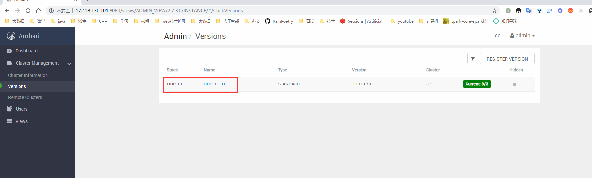

## 使用手册

## 前提条件
- 安装 Ambari-server

## 个人环境
- 操作系统 CentOS7 64位

## 操作
 ```
 将 server 整个目录放到 /var/lib/ambari-server/resources/stacks/HDP/3.1/services 目录下即可
 ```
 注意：3.1 指的是你当前使用的 HDP 的版本，你使用的，每个人的可能不一致。
 
## 注意
笔者所提供的插件是可以直接拿来使用的，不需要任何修改，只需要在本地 yum 源中放入相关的 rpm 依赖就行了，对于 rpm 依赖文件，笔者在 doc 目录下有提供，那些官网上可以找到的 rpm 包，笔者只是提供了相关的下载地址，doc 下的 md 文件只是用于记录个人在安装相关服务时的步骤，帮助理解服务在安装是做了什么事情。