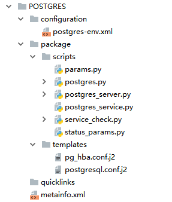

# 			Ambari 集成自定义服务

## 前言

本文主要分为理论部分和实战部分，理论部分将会从源码的角度去引领读者思考自定义服务的实现原理，实战部分会以 PostgreSQL 服务作为例子出发，一步一步教读者如何将 PostgreSQL 服务集成 Ambari 平台中。此外，个人在  [GitHup](https://github.com/RainPoetry/ambari-servers) 上 实现了几个Ambari 自定义服务，感兴趣的读者可以自行参考。

## 理论篇

### 寻找 ambari 平台的入口

搭建过 Ambari 的小伙伴大概都清楚，我们是通过 ambari-server 脚本完成 ambari 平台的启动、关闭等操作，我们跟踪 ambari-server start 的执行情况，发现 ambari 控制的相关实现实际上是通过 ambari-server.py 文件实现的，继续跟踪 ambari-server.py 可以看到最后的执行流程如下：

```
# python 执行 java 操作 ，启动 AmbariServer
procJava = subprocess32.Popen(param_list, env=environ, preexec_fn=make_process_independent)

------- param_list：执行的命令 --------
SERVER_START_CMD_DEBUG_WINDOWS = "{0} " \
    "-server -XX:NewRatio=2 " \
    "-XX:+UseConcMarkSweepGC " \
    "{1} {2} " \
    "-Xdebug -Xrunjdwp:transport=dt_socket,address=5005,server=y,suspend={4} " \
    "-cp {3} " \
    "org.apache.ambari.server.controller.AmbariServer"
```

可以发现，python 脚本最终通过 java 命令行的形式启动 AmbariServer。

### 解读 AmbariServer

对 AmbariServer 代码粗略扫一下，结合 pom.xml 文件，我们可以发现 Ambari 是采用 Jetty 搭建 java 内部 web 容器、Guice 做内部的依赖注入、Jersey 开发 restFul 风格的后端接口、jackson 完成数据的 json 类型处理、日志处理方面用的 Log4j。

#### AmbariServer 执行步骤

##### 1. 加载 ambari.properties 文件

Configuration 对应的就是 ambari.properties 内的数据，这部分的数据加载是通过依赖注入实现的，将 ControllerModule 内部已经实例化好的 Configuration 对象注入过来。

```
Injector injector = Guice.createInjector(new ControllerModule(), new AuditLoggerModule(), new LdapModule());

// check if this instance is the active instance
Configuration config = injector.getInstance(Configuration.class);

-------- ControllerModule 内部的实现 -----
public ControllerModule() throws Exception {
    configuration = new Configuration();
}
protected void configure() {
	bind(Configuration.class).toInstance(configuration);
}
```

##### 2. 解析 common-services、stack、extensions 目录，并将处理结果缓存到内存

处理的入口程序：

```
// 获取注入的 UpdateActiveRepoVersionOnStartup 类，并执行 process
injector.getInstance(UpdateActiveRepoVersionOnStartup.class).process();

----- UpdateActiveRepoVersionOnStartup 初始化 ----
@Inject
public UpdateActiveRepoVersionOnStartup(ClusterDAO clusterDao,
      RepositoryVersionDAO repositoryVersionDao,
      RepositoryVersionHelper repositoryVersionHelper,
      AmbariMetaInfo metaInfo) {
    this.clusterDao = clusterDao;
    this.repositoryVersionDao = repositoryVersionDao;
    this.repositoryVersionHelper = repositoryVersionHelper;
    this.stackManager = metaInfo.getStackManager();
}
```

在 AmbariServer.main() 中获取 UpdateActiveRepoVersionOnStartup 的注入对象时，会先完成该对象的初始话，在 UpdateActiveRepoVersionOnStartup  的构造函数中，会注入 AmbariMetaInfo 对象。

```
@Inject
public AmbariMetaInfo(Configuration conf) throws Exception {
    // ambari.properties
    this.conf = conf;
    // metadata.path=/var/lib/ambari-server/resources/stacks
    String stackPath = conf.getMetadataPath();
    //  common.services.path=/var/lib/ambari-server/resources/common-services
    String commonServicesPath = conf.getCommonServicesPath();
    //  extensions.path=/var/lib/ambari-server/resources/extensions
    String extensionsPath = conf.getExtensionsPath();
    // server.version.file=/var/lib/ambari-server/resources/version
    String serverVersionFilePath = conf.getServerVersionFilePath();
}
@Inject
public void init() throws Exception {
	// 初始化 StackManager
    stackManager = stackManagerFactory.create(stackRoot, commonServicesRoot, extensionsRoot,
}

----- StackManager 的初始化时通过辅助注入来实现的 -------
public interface StackManagerFactory {
  StackManager create(@Assisted("stackRoot") File stackRoot,
      @Nullable @Assisted("commonServicesRoot") File commonServicesRoot,
      @Assisted("extensionRoot") @Nullable File extensionRoot,
      OsFamily osFamily, boolean validate);
}
@AssistedInject
public StackManager(@Assisted("stackRoot") File stackRoot,
      @Assisted("commonServicesRoot") @Nullable File commonServicesRoot,
      @Assisted("extensionRoot") @Nullable File extensionRoot,.......)
install(new FactoryModuleBuilder().build(StackManagerFactory.class));
```

在注入 AmbariMetaInfo 对象的时候，会先调用 AmbariMetaInfo  的构造函数，从 ambari.properties 文件中获取  common-services、stack、extensions、version  路径相关的配置，紧接着调用被 Inject 注解修饰的 init() ，完成 StackManager 的初始化工作，其中 StackManager 的初始化是采用辅助注入的方式实现。

```
public StackManager(....) {
     // 解析 Stack、common-services、extions 目录结构，并将解析结果以 Map 的形式缓存起来
    parseDirectories(stackRoot, commonServicesRoot, extensionRoot);
    // 进一步处理解析出来的 stack 数据。比如：继承关系的处理
    fullyResolveStacks(stackModules, commonServiceModules, extensionModules);
}
```

Ambari 管理界面的所有显示的服务信息都是 Stack 目录解析出来后缓存到本地的数据，这也就是为什么每次添加新的 server 后，都需要重启服务器。

##### 3. 采用 Jersey + Jetty 的方式启动 web 容器

这一块就不多描述了，想了解的话可以直接看 Ambari-Server.run() 部分的代码。

## 实战篇

理论篇废话讲了很多，概括一下，Ambari 管理界面的启动类是 AmbariServer，以及 AmbariServer 在每次启动的时候，都会去扫描 stack 目录下的 metainfo.xml 文件，然后解析 metaInfo.xml 并将解析结果缓存到本地的 Map，以至于每一次 Ambari 获取 service 服务的时候都直接从缓存中读取。

### service目录结构

要实现一个自定义 service，首先从它的目录结构开始了解，然后就是相关的各个文件的作用以及调用关系。



如上所示：

- configuration 目录

  存放服务的配置文件，Ambari 会解析该目录下的配置文件放到前台中展示，让用户进行调整。
  该目录下文件的一般数据格式：
```
<property>
	<name>...</name>
	<display-name>...</display-name>
	<value>...</value>
</property>
```
在安装服务的时候，我们经常会遇到这样的需求，需要创建该服务所特定的用户，来启动和关闭该服务，对于这样的需求，我们的配置可以这么做：
```
<property>
        <name>postgres_user</name>
        <display-name>Postgres User</display-name>
        <value>postgres</value>
        <property-type>USER</property-type>
        <description/>
        <value-attributes>
            <type>user</type>
            <overridable>false</overridable>
            <user-groups>
                <property>
                    <type>cluster-env</type>
                    <name>user_group</name>
                </property>
            </user-groups>
        </value-attributes>
        <on-ambari-upgrade add="false"/>
</property>
<property>
        <name>user_group</name>
        <display-name>Postgres Group</display-name>
        <value>hadoop</value>
        <property-type>GROUP</property-type>
        <description>Postgres user group.</description>
        <value-attributes>
            <type>user</type>
            <overridable>false</overridable>
        </value-attributes>
        <on-ambari-upgrade add="true"/>
</property>
```
这样，ambari 会自动创建一个用户名为 postgres，用户组为hadoop 的用户。

- package/scripts

  存放 python 脚本的目录，python 脚本则是用于管理服务的生命周期，python 脚本的实现将在后面详细介绍。

- package/templates

  存放模板文件的目录，用于和 configuration 目录下的文件配合起来使用，替换服务安装时生成的默认配置文件。

- quicklinks

  ambari 界面的快速链接模块的展示，这一块笔者没有用过。

- metainfo.xml

  服务的心脏文件，定义了该服务的相关信息，Ambari 每次启动的时候都会扫描这个文件，然后将文件的解析结果缓存到本地。

### 理解 metainfo.xml 文件

如下，是笔者的一个 postgres 配置文件

```
<?xml version="1.0"?>
<metainfo>
    <schemaVersion>2.0</schemaVersion>
    <services>
        <service>
            <!--service的名称，该名称必须保障在stack services中是唯一的，一定大写-->
            <name>POSTGRES</name>
            <!--添加服务时显示的服务名称，服务简介，服务版本-->
            <displayName>PostgreSQL</displayName>
            <comment>PostgreSQL是一个功能非常强大的、源代码开放的客户/服务器关系型数据库管理系统（RDBMS）。</comment>
            <version>11.4</version>

            <components>
                <component>
                    <!--组件的名称, 一定大写, 不能重复-->
                    <name>POSTGRES_SERVER</name>
                    <!-- 安装该组件时显示的名称-->
                    <displayName>PostgreSQL</displayName>
                    <!--该组件的类型：MASTER/SLAVE/CLIENT-->
                    <category>MASTER</category>
                    <!--允许/期待实例化数量-->
                    <cardinality>1+</cardinality>
                    <!--执行py脚本-->
                    <commandScript>
                        <!--该script的相对路径-->
                        <script>scripts/postgres_server.py</script>
                        <!--该script的类型，当前仅支持PYTHON-->
                        <scriptType>PYTHON</scriptType>
                        <!--该script的执行超时时间-->
                        <timeout>1800</timeout>
                    </commandScript>
                </component>
            </components>

            <!--该service针对OS的特定package信息，该命令会在component实例中执行-->
            <osSpecifics>
                <osSpecific>
                    <osFamily>any</osFamily>
                    <packages>
                        <package>
                            <name>postgresql11</name>
                        </package>
                        <package>
                            <name>postgresql11-server</name>
                        </package>
                        <package>
                            <name>postgresql11-libs</name>
                        </package>
                    </packages>
                </osSpecific>
            </osSpecifics>

            <!--该service所依赖的配置文件(被其他services拥有的config也要在该列表中指定)-->
            <configuration-dependencies>
                <config-type>postgres-env</config-type>
            </configuration-dependencies>

            <!--是否在rack变更后重启-->
            <restartRequiredAfterChange>false</restartRequiredAfterChange>

        </service>
    </services>
</metainfo>
```

整个文件的可以拆分为4个部分。

- service 基本描述部分

  这一部分定义了 service 的基本信息，只需要注意 name 属性在整个 stack 版本中是全局唯一的，并且要大写

  ```
  <!--service的名称，该名称必须保障在stack services中是唯一的，一定大写-->
  <name>POSTGRES</name>
  <!--添加服务时显示的服务名称，服务简介，服务版本-->
  <displayName>PostgreSQL</displayName>
  <comment>PostgreSQL是一个功能非常强大的、源代码开放的客户/服务器关系型数据库管理系统（RDBMS）。</comment>
  <version>11.4</version>
  ```

- components 部分

  这一部分定义 service 所拥有的 components ，什么叫做 components?比如说，最常见的，你一个zookeeper 是不是可以分为 master 和 slave 部分，其中 master 和 slave 都是 component，但他们对外都统称是 zookeeper。

  ```
  <component>
  	<!--组件的名称, 一定大写, 不能重复-->
  	<name>POSTGRES_SERVER</name>
  	<!-- 安装该组件时显示的名称-->
  	<displayName>PostgreSQL</displayName>
  	<!--该组件的类型：MASTER/SLAVE/CLIENT-->
  	<category>MASTER</category>
  	<!--允许/期待实例化数量-->
  	<cardinality>1+</cardinality>
  	<!--执行py脚本-->
  	<commandScript>
  		<!--该script的相对路径-->
  		<script>scripts/postgres_server.py</script>
  		<!--该script的类型，当前仅支持PYTHON-->
  		<scriptType>PYTHON</scriptType>
  		<!--该script的执行超时时间-->
  		<timeout>1800</timeout>
  	</commandScript>
  </component>
  ```

  其中需要注意的是 name 属性必须大写且在整个 stack 版本中是全局唯一的，该 component 的生命周期的管理是在通过 scripts/postgres_server.py 脚本实现的。具体的实现细节在下一部分将会讲到。

- 安装部分

  安装部分定义了服务的相关依赖，如果是 CentsOS7 操作系统，他会在通过 yum install -y 的形式完成相关依赖的安装，因此，一般我们都会自己搭建一个本地 yum 源，将服务依赖的 rpm 文件放入本地 yum 源中，然后在每一台节点配置该 yum 源，这样就可以做到整个 Ambari 集群内的服务依赖资源的共享
  ```
  <!--该service针对OS的特定package信息，该命令会在component实例中执行-->
  <osSpecifics>
  	<osSpecific>
  		<osFamily>any</osFamily>
  		<packages>
  			<package>
  				<name>postgresql11</name>
  			</package>
  			<package>
  				<name>postgresql11-server</name>
  			</package>
  			<package>
  				<name>postgresql11-libs</name>
  			</package>
  		</packages>
  	</osSpecific>
  </osSpecifics>
  ```

- 配置文件部分

  该配置文件对应的是 configuration 目录下的文件名，注意没有 .xml 后缀，需要了解的是该配置文件是整个 stack 版本下所有服务间共享的，也就是 A 服务定义的 a 配置文件，可以被 B 服务拿来直接使用，该配置文件的值就是你安装该服务时所定义的值
  ```
  <configuration-dependencies>
  	<config-type>postgres-env</config-type>
  </configuration-dependencies>
  ```

### component生命周期

自定义 service 主要实现就是对各个 component 生命周期的管理，分别对应于 install、status、start、stop接口的实现。如下图是 POSTGRES_SERVER 组件的生命周期实现。

```
class Server(Script):
    def install(self, env):
        self.install_packages(env)
        self.configure(env)

    def configure(self, env):
        import params
        env.set_params(params)
        postgres()

    def start(self, env):
        import params
        env.set_params(params)
        daemon_cmd = format('{params.postgres_bin}/pg_ctl -D {params.postgres_data} -l {params.postgres_log_file} start')
        Execute(daemon_cmd,
                user=params.postgres_user
        )


    def stop(self, env):
        import params
        env.set_params(params)
        daemon_cmd = format('kill -INT `head -1 {params.postgres_pid_file}`')
        try:
            Execute(daemon_cmd,
                    user=params.postgres_user)
        except:
            show_logs(params.postgres_log_file, params.postgres_user)
            raise
        # File(params.postgres_pid_file,
        #      action = "delete"
        #      )

    def status(self, env):
        import status_params
        env.set_params(status_params)
        pid_file = status_params.postgres_pid_file
        if not pid_file or not os.path.isfile(pid_file):
            raise ComponentIsNotRunning()
        # check_process_status(pid_file)
        # print "status"

    def get_pid_files(self):
        import params
        return [params.postgres_pid_file]

if __name__ == "__main__":
    Server().execute()
```

- install()  

  这一块主要完成Service 服务的安装工作，self.install_packages(env) 会调用 在 metainfo.xml 中的安装部分的 packages，完成相关依赖的下载。

- start()、stop()

  start() 和 stop() 根据各个服务的情况，调用相关的命令来进行启动，只要不报错，就是 success。

- status()

  Ambari 会定时调用这个接口来判断服务是否挂了，如果在 status() 执行的时候报错，那么该组件的状态会显示为 Fail， 如果没有报错，则为 success，component在每次的 start() 和 stop() 的时候都会去检验其状态，如果调用了 stop，他会通过 status() 来判断服务是否关闭，只有当status() 抛出 ComponentIsNotRunning 异常，Ambari 才会认为 service 已关闭，否则会一直阻塞等待在那里。

## 集成感想

本人是一个 python 小白，就连简单的 if else 循环都要百度一下，但是这并不妨碍我们开发 python 脚本，ambari-agent 模块提供了大量的python 脚本方便我们直接调用，真正需要我们写的也就是逻辑部分，把执行逻辑串联起来，这一部分也不懂的话可以直接百度，很容易就可以得到结果。

## 小技巧

#### ambari-agent 易用的一些接口

- format 	（用于生成动态字符串）

  ```
  from resource_management.libraries.functions.format import format
  
  data = 123
  info = format("{data}")
  ```

- sudo  （提供了大量的文件操作函数）

  ```
  from resource_management.core import sudo
  # 读取文件
  data = sudo.read_file(params.mysql_log_file)
  ```

- Execute  （用于执行 Linux 命令）

  ```
  from resource_management.core.resources.system import Execute
  
  Execute("ls /",
  	sudo = True)	// 使用管理员权限
  ```

- File  （生成一个文件）

  ```
   from resource_management.core.resources.system import  File
   
   # 生成 params.postgres_data + “/” + name 的文件
   File(os.path.join(params.postgres_data, name),
           content=Template(template_name),	// 指定文件内容
           owner=params.postgres_user,		// 指定文件所有者
           group=params.user_group,			// 指定文件组
           mode=0755							// 指定文件的权限 - rwx
           )
  ```

- Directory （生成一个目录）

  ```
  from resource_management.core.resources.system import Directory
  
   # 创建目录
   Directory(params.postgres_log_dir,
                    owner=params.postgres_user,	// 指定目录所有者
                    create_parents = True,		// 父级目录不存在，则创建
                    group=params.user_group,		// 指定目录组
                    mode=0750						// 指定目录的权限 - rwx
                    )
  ```
#### 获取配置参数信息

ambari-agent 提供 Script.get_config() 来获取所有的参数，参数是从 /var/lib/ambari-agent/data/command-xxx.json 文件中获取，其中索引号可以从你的最后的安装步骤中获取。如下图就是 command-1358.json，也就是说 Script.get_config()  指的就是 command-1358.json 内的数据

## 参考链接

[How-To Define Stacks and Services](https://cwiki.apache.org/confluence/display/AMBARI/How-To+Define+Stacks+and+Services)

[自动化部署](https://ifengkou.github.io/ambari%E6%8F%92%E4%BB%B6%E5%BC%80%E5%8F%91%E7%AC%94%E8%AE%B0.html)

[metainfo.xml 详解](https://841809077.github.io/2018/06/07/metainfo.xml%E8%AF%A6%E8%A7%A3.html)